# Face missing parts reconstruction algorithm
The repository contains scripts that generate averaged depth image and reconstruct given image. 

Sample dataset is located in dataset folder. It contains images of human faces of size 116x120. Images in test 
set have arbitrary distributed missing part.

# 1. Train samples
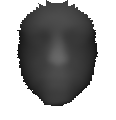 
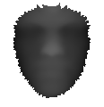
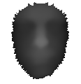
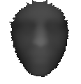
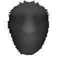

# 2. Reconstruction results

|               Original image                |              Reconstructed using symmetry               |         Reconstructed using average image   and symmetry          |
|:-------------------------------------------:|:-------------------------------------------------------:|:---------------------------------------------------:|
| 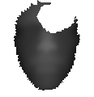 | 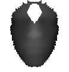 | 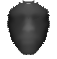 |
| 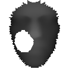 | 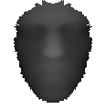 | 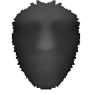 |
| 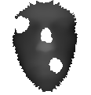 |  | 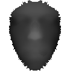 |
| 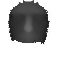 | 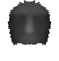 | 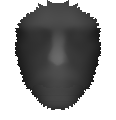 |

# 3. Requirements
- Ubuntu 18.04
- Python 3.7.4
- numpy 1.17.2
- pillow 6.2.0

# 4. Installation
## 1. Clone repository:

    git clone https://github.com/Robator/face_reconstruction.git

## 2. Install dependencies:

    pip install -r requirements.txt

---

# 5. How to run

## 1. Create average image:

    python main.py train dataset/train

## 2. Reconstruct images
Reconstruct images in test folder run and store results in dataset/rec_images folder run:

    python main.py test dataset/test --out=dataset/rec_images

---

# 6. Tests
To run tests run from the root directory:

    ./scripts/tests.sh

# 7. Algorithm description
When train is launched, an average image is created in the following way. At the first iteration, the average image 
equals to the first image(or the first batch). By default, batch size equals to 1
Next, the intersection area between the current and the average image is taken and average pixel values between 
current(or batch) and average image are calculated for each image in dataset.

When inferencing, the algorithm tries to replace white areas. For each such pixel symmetrical to vertical image line pixel
value is used if it is not white otherwise value from an average image.

# 8. Limitations
- In case face on an image to reconstruct is wider than on an average one and the missing area is in that place, hollows
may appear

# 9. Contact
Contact me on [Linkedin](https://www.linkedin.com/in/ematsuev/)