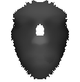

# Missing Parts Reconstruction Algorithm
There are two sets of depth images of the same size (116x120). They both represent different human faces. Images in test 
set have arbitrary distributed missing part. \
The repository contains a script that receives an image with missing data and outputs its
reconstructed representation.

# Train samples
 

# Reconstruction results

|               Original image                |              Reconstructed using symmetry               |         Reconstructed using average image   and symmetry          |
|:-------------------------------------------:|:-------------------------------------------------------:|:---------------------------------------------------:|
|  |  |  |
|  |  |  |
|  |  |  |
|  |  |  |

# Requirements
- Ubuntu 18.04
- Python 3.7.4
- numpy 1.17.2
- pillow 6.2.0

# Installation
To install dependencies run the following command:

    pip install -r requirements.txt

# How to run

To run tests run from the root directory:

    ./scripts/tests.sh

To create average image run:

    python main.py train dataset/train

To reconstruct images in test folder run and store results in dataset/rec_images folder run:

    python main.py test dataset/test --out=dataset/rec_images

# Algorithm description
When train is launched, an average image is created in the following way. At the first iteration, the average image 
equals to the first image(or the first batch). By default, batch size equals to 1
Next, the intersection area between the current and the average image is taken and average pixel values between 
current(or batch) and average image are calculated for each image in dataset.

When inferencing, the algorithm tries to replace white areas. For each such pixel symmetrical to vertical image line pixel
value is used if it is not white otherwise value from an average image.

# Limitations
- In case face on an image to reconstruct is wider than on an average one and the missing area is in that place, hollows
may appear